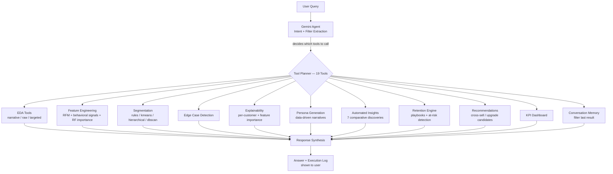

# Retail Banking AI Agent — Customer Segmentation & Personalization

An agent-driven analytics system for a retail bank that performs automated EDA, segments customers into Priority / Regular / Dormant tiers, generates data-driven personas, surfaces actionable insights, detects churn risks, and recommends retention strategies — all orchestrated dynamically by an LLM agent with **19 specialized tools**.

---

## 🏆 Key Features

- **19-Tool AI Agent** — Gemini-powered function calling dynamically selects the right tools for each query
- **4 Segmentation Methods** — Rule-based, KMeans, Hierarchical, and DBSCAN with side-by-side evaluation
- **Data-Driven Personas** — Persona names and narratives adapt to actual data thresholds (Ultra-Premium vs Affluent vs Near-Priority)
- **7 Types of Automated Insights** — Wealth concentration, activity-vs-balance patterns, dormant hidden value, weekend behavior, volatility risk, upgrade sizing, engagement cliffs
- **Retention Playbooks** — Segment-specific strategies to protect Priority customers, grow Regular, and reactivate Dormant
- **Churn Risk Detection** — Identifies Priority downgrade risks, Regular dormancy risks, and high-value dormant churn
- **Feature Importance Analysis** — Random Forest-based feature selection identifies the most definitive customer attributes
- **Per-Customer Explainability** — Why each customer landed in their segment, with percentile/ratio comparisons
- **Conversation Memory** — Follow-ups like "show only premium ones" filter in-place without re-running pipelines
- **Human-in-the-Loop** — Ambiguous queries intercepted in code before the LLM can guess

---

## Problem Statement

A retail bank currently applies broad, one-size-fits-all marketing strategies, resulting in low customer engagement and suboptimal product adoption. This project builds an AI agent that:

- Performs automated EDA on customer transaction data
- Segments customers based on behavioral and financial attributes
- Generates interpretable personas that change with the data
- Surfaces actionable insights — not just averages, but discoveries
- Recommends retention strategies to prevent churn and drive upgrades
- Explains every decision — which features matter, why a customer belongs to a segment

The agent simulates how a bank's analytics team would derive actionable insights with minimal manual intervention.

---

## Dataset

| | |
|---|---|
| **Name** | Bank Customer Segmentation (1M+ Transactions) |
| **Source** | Kaggle — https://www.kaggle.com/datasets/shivamb/bank-customer-segmentation |
| **Description** | Real transactional data from an Indian bank (Aug–Oct 2016), containing customer demographics (`CustomerID`, `CustomerDOB`, `CustGender`, `CustLocation`) and transaction-level records (`TransactionAmount (INR)`, `CustAccountBalance`, `TransactionDate`, `TransactionTime`). All customer personal identifiers have been anonymized by the dataset publisher. |
| **License/Usage** | Public dataset, used strictly for hackathon educational/demo purposes. No proprietary or confidential data is used. |
| **Scale Note** | The full dataset contains 1M+ rows. By default the app samples 100,000 rows (`DEFAULT_SAMPLE_SIZE` in `src/config.py`, adjustable from the sidebar) to keep EDA and clustering fast for live demos. Toggle "Use full dataset" for complete analysis. |

---

## Architecture



Ambiguous queries (e.g. "show me the best customers") are intercepted **in code** before reaching the LLM, guaranteeing a clarifying question rather than a guessed answer (human-in-the-loop).

---

## Solution Approach

### 1. Ingestion & Preprocessing

Raw transaction rows are grouped by `CustomerID` and aggregated into rich customer-level features:

| Feature | Description |
|---|---|
| `current_balance` | Most recent account balance |
| `avg_balance` | Average balance across all transactions |
| `max_balance` | Peak balance observed |
| `balance_std` | Balance variability |
| `transaction_frequency` | Total number of transactions |
| `total_spend` | Sum of all transaction amounts |
| `avg_transaction_size` | Average spend per transaction |
| `transaction_size_std` | Variability in transaction amounts |
| `recency_days` | Days since last transaction |
| `spend_trend` | +1 (increasing), -1 (decreasing), 0 (flat) |
| `balance_volatility` | Coefficient of variation — irregularity signal |
| `weekend_transaction_ratio` | Proportion of weekend transactions |

### 2. Feature Selection

Random Forest classifier ranks features by importance for segmentation, identifying which behavioral and financial attributes truly differentiate customer groups. The top features and their cumulative importance are surfaced to the user.

### 3. Segmentation

Four selectable methods with automatic cluster-to-label mapping:

| Method | Description | Evaluation |
|---|---|---|
| Rule-based | Balance >₹50k or (Balance >₹20k + 10+ transactions) → Priority | Threshold-based |
| KMeans | Centroid-based clustering with inertia | Silhouette, DB, CH scores |
| Hierarchical | Agglomerative clustering | Silhouette, DB, CH scores |
| DBSCAN | Density-based with noise detection | Silhouette, DB, CH scores |

`tool_compare_segmentation_methods` runs all three ML methods and reports metrics side-by-side.

### 4. Persona Generation

Personas are data-derived, not template-filled. The same code produces different persona names and narratives depending on the actual data:

- Priority with 5x average balance → **"Ultra-Premium Power Users"**
- Priority with 2x average balance → **"Affluent Established Customers"**
- Regular near Priority threshold → **"Near-Priority Aspirational Customers"**
- Regular with high weekend activity → **"Lifestyle-Focused Retail Bankers"**

### 5. Automated Insights

Seven types of comparative insights are automatically generated from the segmented data:

1. **Wealth Concentration** — What % of total balances do Priority customers hold?
2. **Activity vs Balance** — Is Priority status wealth-driven or activity-driven?
3. **Dormant Hidden Value** — How much money sits in abandoned accounts?
4. **Weekend Patterns** — Which segment banks on weekends?
5. **Volatility Risk** — Are Priority balances unstable?
6. **Upgrade Opportunity** — How many Regulars are within striking distance?
7. **Engagement Cliff** — At what inactivity threshold do customers go dormant?

### 6. Retention Engine

Three-tier retention framework:

- **Priority → PROTECT** — relationship management, early warning systems, sticky products, loyalty recognition
- **Regular → GROW** — engagement depth, digital adoption, life-event triggers, auto-save programs
- **Dormant → WIN BACK** — friction removal, segmented win-back by balance tier, re-onboarding, closure prevention

Plus at-risk detection: flags Priority downgrade risks, Regular dormancy risks, and high-value dormant churn with specific intervention recommendations.

### 7. Explainability

- **Global:** Feature importance rankings showing which attributes drive segmentation
- **Per-customer:** Why a specific customer is in their segment, with percentile/ratio comparison against Regular-segment average (e.g., "3.2x the Regular average balance, top 8% of all customers")

### 8. Conversation Memory

The agent remembers the last filtered result. Follow-ups like "show only the premium ones" or "filter those down" work in-place without re-running the full pipeline.

### 9. Human-in-the-Loop

Ambiguous queries ("show me the best customers", "which ones should I target", "who are the important customers") are intercepted in code before reaching the LLM, guaranteeing a clarifying question rather than a guess. Covers 10 ambiguity trigger words.

### 10. Visible Agent Reasoning

Every tool call is logged with step-by-step status shown during startup and an expandable "Agent reasoning / execution log" panel for every query.

---

## Agent Tools (19 Total)

| Category | Tool | Purpose |
|---|---|---|
| EDA | `tool_eda_narrative_summary` | Executive-friendly narrative EDA summary |
| EDA | `tool_eda_summary` | Full raw EDA report (stats dump) |
| EDA | `tool_dynamic_eda` | Targeted EDA — missing values / summary stats / correlation |
| Feature Engineering | `tool_feature_importance` | Random Forest feature importance rankings |
| Segmentation | `tool_run_segmentation` | Run/re-run segmentation (4 methods) |
| Segmentation | `tool_compare_segmentation_methods` | Side-by-side comparison of all ML methods |
| Segmentation | `tool_identify_edge_cases` | Anomalous customers not fitting clean segments |
| Explainability | `tool_explain_customer` | Per-customer segment explanation with percentiles |
| Explainability | `tool_lookup_customer` | Customer ID lookup (returns `NOT_FOUND` if absent) |
| Insights | `tool_get_personas` | Data-driven narrative customer personas |
| Insights | `tool_get_profiles` | Segment-level averages and counts |
| Insights | `tool_get_segment_insights` | 7 types of comparative data-driven insights |
| Insights | `tool_get_model_evaluation` | Silhouette / Davies-Bouldin / Calinski-Harabasz |
| Insights | `tool_get_business_kpis` | Headline KPI dashboard numbers |
| Retention | `tool_get_retention_strategies` | Segment-specific retention playbooks |
| Retention | `tool_identify_at_risk_customers` | Churn/downgrade risk detection |
| Recommendations | `tool_get_recommendation` | Cross-sell strategy with per-customer secondary rules |
| Recommendations | `tool_find_upgrade_candidates` | Regular customers closest to Priority + conversion advice |
| Memory | `tool_filter_last_segment` | Filter previous result by tier (no re-run) |

---

## Tech Stack

| Layer | Technology |
|---|---|
| Frontend | Streamlit (6-tab UI with KPI cards, charts, exports) |
| Agent / LLM | Google Gemini (`gemini-2.5-flash`) via `google-genai` SDK with native function calling |
| ML | scikit-learn (KMeans, Agglomerative, DBSCAN, StandardScaler, Random Forest, silhouette/Davies-Bouldin/Calinski-Harabasz) |
| Data | pandas, numpy |
| Visualization | matplotlib, seaborn |
| Testing | pytest |
| Containerization | Docker / docker-compose |

---

## Setup

### Prerequisites

- Python 3.9+
- Gemini API key ([get one free](https://ai.google.dev/))
- [Bank Customer Segmentation dataset](https://www.kaggle.com/datasets/shivamb/bank-customer-segmentation) (download from Kaggle)

### Installation

```bash
# Clone the repository
git clone https://github.com/avanishpandey10/Customer-Segmentation-and-Personalization-Agent-for-Retail-Banking
cd Customer-Segmentation-and-Personalization-Agent-for-Retail-Banking

# Create and activate virtual environment
python -m venv venv
source venv/bin/activate      # Windows: venv\Scripts\activate

# Install dependencies
pip install -r requirements.txt

# Set up environment variables
cp .env.example .env
# Edit .env and add your GEMINI_API_KEY

# Create data directory and add dataset
mkdir -p data
# Place bank_transactions.csv in the data/ folder
```

### Configuration (`.env`)

```bash
GEMINI_API_KEY=your_api_key_here
DATASET_PATH=data/bank_transactions.csv
DEFAULT_SAMPLE_SIZE=100000
LOG_LEVEL=INFO
```

### Usage

```bash
streamlit run app.py
```

Open [http://localhost:8501](http://localhost:8501) in your browser.

### Quick Start

1. Enter your Gemini API key in the sidebar (or load from `.env`)
2. Upload `bank_transactions.csv`
3. Wait for agent initialization (preprocessing + default segmentation)
4. Start asking questions in the **Agent Chat** tab

---

## Example Queries

**Segmentation:**
- "Segment customers using kmeans with 4 clusters"
- "Compare clustering methods — which one works best?"
- "Identify any edge cases in the segmentation"

**Insights:**
- "What insights can you derive about each segment?"
- "Generate customer personas for each segment"
- "Which features drive the segmentation?"

**Explainability:**
- "On what basis were priority customers selected?"
- "Why is customer C12345678 in the Priority segment?"

**Retention:**
- "Which customers are at risk of churning?"
- "Show retention strategies for Priority customers"
- "What should we do about high-value dormant accounts?"

**Recommendations:**
- "Which regular customers can be converted to priority? What should be done?"
- "What products should we recommend to Dormant customers?"

**Conversation Memory:**
- First: "Segment customers using kmeans"
- Then: "Show only the priority ones" (filters in-place, no re-run)

**Human-in-the-Loop:**
- "Show me the best customers" → Agent asks: "By balance, frequency, or spend?"

---

## Tabs Overview

| Tab | Content |
|---|---|
| 💬 Agent Chat | Natural language query interface with execution logging |
| 📊 EDA Summary | Executive-friendly narrative EDA (default) + raw stats (expandable) |
| 🎯 Customer Segments | Segmented data with CSV/JSON export, segment distribution charts, feature importance |
| 📈 Model Evaluation | Clustering metrics dashboard with side-by-side method comparison |
| 💡 Insights & Retention | Automated comparative insights + customer personas + retention playbooks + at-risk detection |
| 📋 Recommendations | Cross-sell strategy generator per segment tier |

---

## Docker

```bash
cp .env.example .env   # fill in GEMINI_API_KEY
docker-compose up --build
```

Open [http://localhost:8501](http://localhost:8501).

---

## Tests

```bash
pytest tests/ -v
```

---

## Project Structure

```
.
├── app.py                          # Streamlit UI (6 tabs, KPI dashboard, charts)
├── requirements.txt                # Python dependencies
├── README.md                       # This file
├── Dockerfile                      # Docker configuration
├── docker-compose.yml              # Docker Compose configuration
├── .dockerignore                   # Docker ignore rules
├── .env.example                    # Environment variables template
├── data/                           # Dataset directory
│   └── bank_transactions.csv       # Kaggle dataset (user-provided)
├── tests/
│   └── test_pipeline.py            # Pytest test suite
└── src/
    ├── __init__.py
    ├── config.py                   # Configuration (API key, model, sample size)
    ├── logger_setup.py             # Structured logging
    ├── agent.py                    # RetailBankingAgent (19 tools, HITL, memory)
    └── tools/
        ├── __init__.py
        ├── eda_tool.py             # EDA (narrative summary, raw, targeted, validation)
        ├── feature_engineering.py  # RFM + behavioral signals + feature selection
        ├── segmentation_tool.py    # 4 methods + edge cases + comparison
        ├── explainability_tool.py  # Personas, insights, retention, explainability, recommendations
        └── kpi_tool.py             # Business KPI computation
```

---

## How It Scores Against Requirements

| Requirement | Implementation | Status |
|---|---|---|
| Automated EDA | Narrative summary + raw stats + targeted metrics | ✅ |
| Customer Segmentation | 4 methods with evaluation + edge cases | ✅ |
| Interpretable Personas | Data-driven, threshold-aware naming and narratives | ✅ |
| Personalized Recommendations | Cross-sell + upgrade + retention strategies | ✅ |
| Human-Readable Insights | 7 types of automated comparative insights | ✅ |
| Feature Selection | Random Forest importance with interpretation | ✅ |
| Model Evaluation | Silhouette, DB, CH scores + method comparison | ✅ |
| Explainability | Per-customer with percentile context + global feature importance | ✅ |
| Human-in-the-Loop | Code-level ambiguity detection (10 trigger patterns) | ✅ |
| Conversation Memory | Filter-by-tier without re-running pipeline | ✅ |
| Visualization | Segment charts, feature importance, KPI dashboard | ✅ |
| CSV Export | Downloadable segmented data, personas, KPI summary | ✅ |

---

## External Tools / AI Assistance Disclosure

- **Google Gemini API** (`gemini-2.5-flash`) — powers the conversational agent and its 19-tool orchestration logic via native function calling.
- **Development Assistance** — AI coding assistant (Claude) used for code review, architecture refinement, and documentation.

---

## License

This project is built for educational/hackathon demonstration purposes using the publicly available Bank Customer Segmentation dataset from Kaggle: https://www.kaggle.com/datasets/shivamb/bank-customer-segmentation. No proprietary or confidential data is used.
