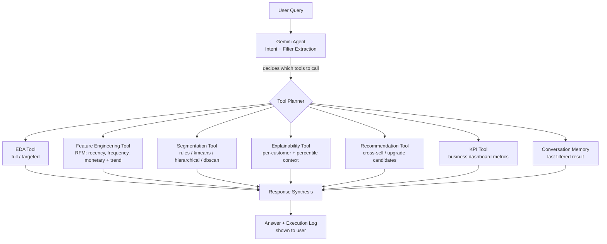

# Retail Banking AI Agent — Customer Segmentation & Personalization

An agent-driven analytics system for a retail bank that performs automated EDA,
segments customers into **Priority / Regular / Dormant** tiers, explains *why*
each customer landed in their segment, and recommends cross-sell strategies —
all orchestrated dynamically by an LLM agent based on natural-language queries.

## Problem Statement

A retail bank currently applies broad, one-size-fits-all marketing strategies,
resulting in low customer engagement and suboptimal product adoption. This
project builds an AI agent that segments customers using behavioral and
financial attributes, generates interpretable personas, and recommends
personalized banking products per segment — simulating how a bank's analytics
team would derive actionable insights with minimal manual intervention.

## Dataset

- **Name:** Bank Customer Segmentation (1M+ Transactions)
- **Source:** Kaggle — https://www.kaggle.com/datasets/shivamb/bank-customer-segmentation
- **Description:** Real transactional data from an Indian bank (Aug–Oct 2016),
  containing customer demographics (`CustomerID`, `CustomerDOB`, `CustGender`,
  `CustLocation`) and transaction-level records (`TransactionAmount (INR)`,
  `CustAccountBalance`, `TransactionDate`, `TransactionTime`). All customer
  personal identifiers have already been anonymized by the dataset publisher.
- **License/Usage:** Public dataset, used strictly for this hackathon's
  educational/demo purpose. No proprietary or confidential data is used.
- **Note on scale:** The full dataset contains 1M+ rows. By default the app
  samples 100,000 rows (`DEFAULT_SAMPLE_SIZE` in `src/config.py`, also
  adjustable from the sidebar) to keep EDA and clustering fast for a live
  demo, per the hackathon's "batch analysis on a sample is sufficient" scope
  guidance. The full file can still be used via the "Use full dataset" toggle.

## Architecture



Ambiguous queries (e.g. "show me the best customers" with no metric stated)
are intercepted **in code** before reaching the LLM, guaranteeing a
clarifying question rather than a guessed answer (human-in-the-loop).

## Solution Approach

1. **Ingestion & preprocessing** — raw transaction rows are grouped by
   `CustomerID` and aggregated into customer-level features: `current_balance`,
   `avg_balance`, `max_balance`, `transaction_frequency`, `total_spend`,
   `avg_transaction_size`, plus RFM-style extras `recency_days` and
   `spend_trend`.
2. **Segmentation** — four selectable methods: rule-based thresholds, KMeans,
   Agglomerative (Hierarchical), and DBSCAN. Cluster→label mapping is ranked
   using a balance+frequency composite score, not arbitrary column order.
   `tool_compare_segmentation_methods` runs all three ML methods and reports
   Silhouette, Davies-Bouldin, and Calinski-Harabasz side by side.
3. **Explainability** — segment-level profiles (aggregate averages + rule
   thresholds) and **per-customer** explanations with a percentile/ratio
   comparison against the Regular-segment average.
4. **Recommendation engine** — base strategy per segment plus secondary
   rule-layer logic (e.g. large average transaction size within Priority, or
   long inactivity within Dormant) for a sharper pitch.
5. **KPI dashboard** — headline business metrics (customer counts per tier,
   average balance, average spend, cross-sell potential) surfaced as
   `st.metric` cards and available to the agent as a tool.
6. **Conversation memory** — the agent remembers the last segmentation/filter
   result, so follow-ups like "show only the premium ones" filter in place
   instead of re-running the whole pipeline.
7. **Visible agent reasoning** — every tool call is logged with a timestamp
   and shown in an expandable "Agent reasoning / execution log" panel, plus
   step-by-step status during startup.
8. **Agent orchestration** — a Gemini-powered agent (native function calling)
   parses the user's natural-language query and decides which tools to
   invoke, in what order, and on what data.

### Agent Tools

| Tool | Purpose |
|---|---|
| `tool_eda_summary` | Full EDA report |
| `tool_dynamic_eda` | Targeted EDA — missing values / summary stats / correlation |
| `tool_run_segmentation` | Runs/re-runs segmentation (`rules`, `kmeans`, `hierarchical`, `dbscan`) |
| `tool_compare_segmentation_methods` | Compares KMeans/Hierarchical/DBSCAN metrics side by side |
| `tool_get_profiles` | Segment-level averages and counts |
| `tool_get_model_evaluation` | Silhouette / Davies-Bouldin / Calinski-Harabasz / rule thresholds |
| `tool_lookup_customer` | Looks up a customer by ID; returns `NOT_FOUND` if absent (no hallucination) |
| `tool_explain_customer` | Per-customer explanation with percentile context |
| `tool_find_upgrade_candidates` | Regular customers closest to Priority + conversion advice |
| `tool_filter_last_segment` | Filters the previous result by tier (conversation memory) |
| `tool_get_business_kpis` | Headline KPI dashboard numbers |
| `tool_get_recommendation` | Cross-sell/up-sell strategy, with secondary rules for a specific customer |

## Tech Stack

- **Frontend:** Streamlit
- **Agent / LLM:** Google Gemini (`gemini-3.6-flash`) via `google-genai` SDK, native function calling
- **ML:** scikit-learn (KMeans, Agglomerative, DBSCAN, StandardScaler, silhouette/Davies-Bouldin/Calinski-Harabasz)
- **Data:** pandas, numpy
- **Visualization:** matplotlib, seaborn
- **Testing:** pytest
- **Containerization:** Docker / docker-compose

## Setup

```bash
git clone <your-repo-url>
cd <your-repo-name>
python -m venv venv
source venv/bin/activate      # Windows: venv\Scripts\activate
pip install -r requirements.txt
cp .env.example .env          # then fill in GEMINI_API_KEY
```

Get a free API key at https://aistudio.google.com/apikey.

## Usage

```bash
streamlit run app.py
```

1. Enter your Gemini API key in the sidebar (or set it via `.env`).
2. Upload the dataset CSV (e.g. `bank_transactions.csv` from the Kaggle link above).
3. Optionally adjust the sample size in the sidebar for faster demos.
4. Use the **Agent Chat** tab to ask natural-language questions, e.g.:
   - "On what basis were priority customers selected?"
   - "Segment customers using kmeans with 4 clusters"
   - "Which regular customers can be converted to priority customers? What should be done for the same?"
   - "Show only the priority ones" (after a segmentation — tests conversation memory)
   - "Show me the best customers" (tests guaranteed clarification)
   - "Compare clustering methods"
   - "What are the business KPIs?"
5. Explore the **KPI Dashboard**, **Dynamic EDA**, **Customer Segments**,
   **Model Evaluation**, and **Recommendations** tabs for supporting visuals
   and CSV/JSON export.

### Run with Docker

```bash
cp .env.example .env   # fill in GEMINI_API_KEY
docker-compose up --build
```

Then open http://localhost:8501.

### Run tests

```bash
pytest tests/ -v
```

## External Tools / AI Assistance Disclosure

- Google Gemini API (`gemini-3.6-flash`) — powers the conversational agent
  and its tool-orchestration logic.
- Development assisted by an AI coding assistant (Claude) for code review,
  bug fixes, and documentation.

## Project Structure

```
.
├── app.py
├── requirements.txt
├── README.md
├── Dockerfile
├── docker-compose.yml
├── .dockerignore
├── .env.example
├── tests/
│   └── test_pipeline.py
└── src/
    ├── config.py
    ├── logger_setup.py
    ├── agent.py
    └── tools/
        ├── eda_tool.py
        ├── feature_engineering.py
        ├── segmentation_tool.py
        ├── explainability_tool.py
        └── kpi_tool.py
```